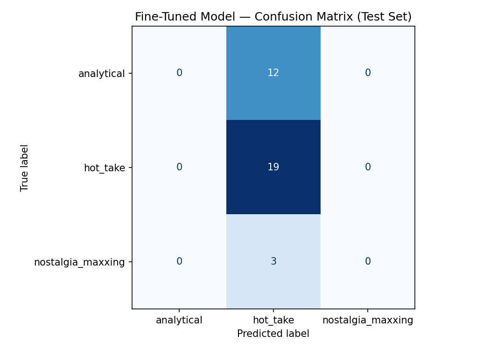

{
  "baseline_accuracy": 0.6765,
  "finetuned_accuracy": 0.5588,
  "improvement": -0.1176,
  "test_set_size": 34,
  "label_map": {
    "analytical": 0,
    "hot_take": 1,
    "nostalgia_maxxing": 2
  },
  "model": "distilbert-base-uncased"
}

